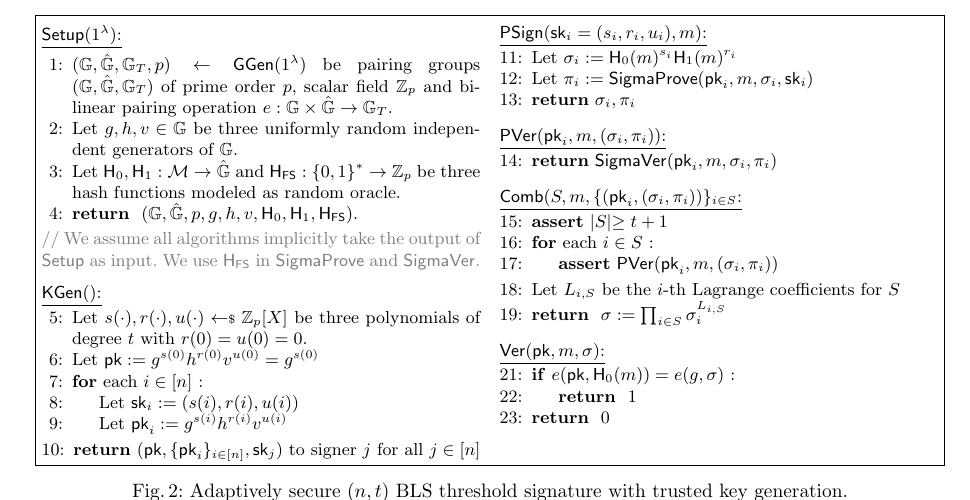
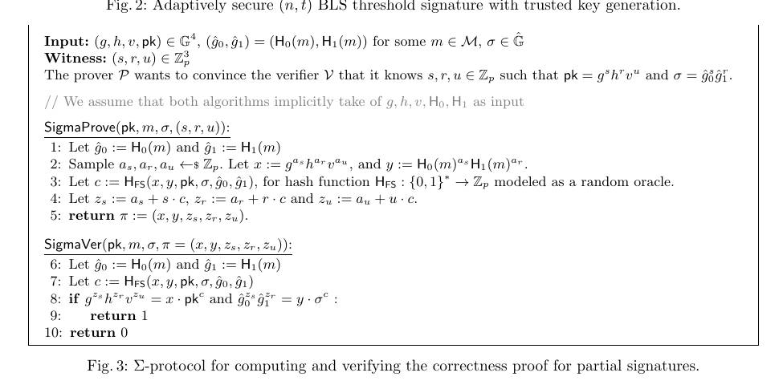
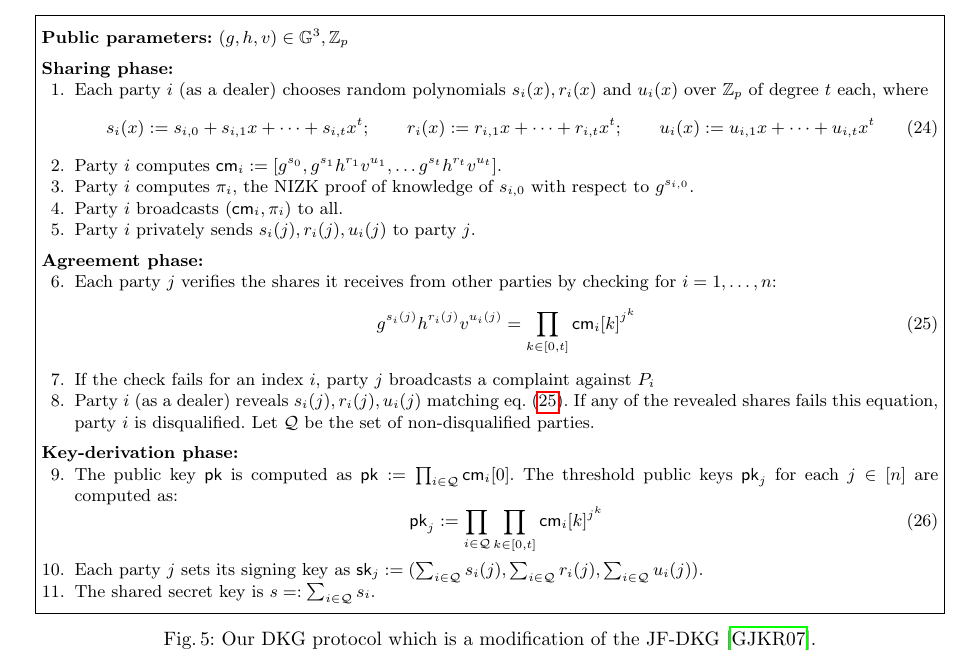

# 《Adaptively Secure BLS Threshold Signatures from DDH and co-CDH》定向精读

- 作者：Sourav Das, Ling Ren
- 年份：2024
- 类型：密码协议 / 门限签名论文
- 来源：用户提供的 32 页可选择文本 PDF
- 阅读范围：围绕研究问题、研究动机、完整构造、DKG、安全直觉与性能的定向精读

> 用户明确要求的是博客所需的定向解读，因此本文件保留关键原文—中文对照和稳定页码锚点，不复刻整篇论文。

## 页面与主题索引

| 页码 | 主题 | 锚点 |
|---|---|---|
| p.1 | 研究问题、动机与贡献 | [S001](#S001)–[S003](#S003) |
| p.3–4 | 技术总览与额外多项式 | [S004](#S004) |
| p.8–10 | 门限签名与 Σ 证明 | [S005](#S005)–[S007](#S007) |
| p.19–24 | DKG 设计 | [S008](#S008)、[F003](#F003) |
| p.27 | 实验结果 | [S009](#S009) |
| p.28 | 结论与安全假设 | [S010](#S010) |

## 术语表

| Canonical term | 首次定义 | 中文统一译法 | 决定 |
|---|---|---|---|
| threshold signature | threshold signature | 门限签名 | 全文固定使用 |
| adaptive adversary | adversary choosing corruptions during execution | 自适应攻击者 | 不与“动态攻击者”混用 |
| static adversary | corruption set fixed at the start | 静态攻击者 | 全文固定使用 |
| DDH | decisional Diffie–Hellman | 判定型 Diffie–Hellman | 首次写全称 |
| co-CDH | co-computational Diffie–Hellman | co-计算型 Diffie–Hellman | 保留 `co-CDH` |
| ROM | random oracle model | 随机预言机模型 | 首次写全称 |
| DKG | distributed key generation | 分布式密钥生成 | 首次写全称 |
| SIP | single inconsistent party | 单一不一致参与方 | 保留 `SIP` |
| Σ-protocol | Sigma protocol | Σ 协议 | 用于部分签名正确性证明 |
| signature share | partial signature | 部分签名 | 两种英文指向同一对象 |

## 研究问题与动机

### 主要研究问题

**Source:** p.1 S001

**Original:** In this paper, we present the first adaptively secure threshold BLS signature scheme that relies on the hardness of DDH and co-CDH in asymmetric pairing groups in the Random Oracle Model (ROM).

**中文：** 本文给出首个在随机预言机模型中、依赖非对称配对群上 DDH 与 co-CDH 困难性的自适应安全 BLS 门限签名方案。

**阅读说明：** 贡献的限定词很重要：目标不只是“自适应安全”，还包括较常见的安全假设、非交互签名和标准 BLS 验证兼容性。

### 静态安全与自适应安全的差距

**Source:** p.1 S002

**Original:** A static adversary must decide the set of signers to corrupt at the start of the protocol. In contrast, an adaptive adversary can decide which signers to corrupt during the execution of the protocol based on its view of the execution.

**中文：** 静态攻击者必须在协议开始时确定腐化集合；自适应攻击者则能依据执行过程中看到的信息，随时选择接下来腐化的签名者。

### 为什么不能直接沿用旧方案

**Source:** p.1–3 S003

**Original:** Existing adaptively secure threshold signature schemes in the literature have to make major sacrifices ... or strong and non-standard assumptions such as one more discrete logarithm (OMDL) in the algebraic group model (AGM).

**中文：** 既有自适应安全门限签名通常需要明显代价，例如安全擦除、低效的非承诺加密，或 OMDL/AGM 等更强且非标准的假设。

**阅读说明：** Bacho–Loss 还说明，若坚持原始 Boldyreva 构造，OMDL 类型的强假设具有必要性；这迫使作者修改构造，而不是只修改证明。

## 算法总览

### 两个额外多项式的作用

**Source:** p.3–4 S004

**Original:** The signing key of signer i is sk_i = (s(i), r(i)) and the public verification key of signer i is pk_i = g^{s(i)} h^{r(i)}. ... Since r(0) = 0, the interpolation yields a standard BLS signature.

**中文：** 技术总览先用两多项式简化版本解释核心：签名者持有 `s(i)` 与 `r(i)`，而 `r(0)=0` 使额外的 `H1` 项在零点插值时消失，最终仍得到标准 BLS 签名。

**阅读说明：** 完整构造再加入 `u(x)`。`u(i)` 不进入部分签名，只进入门限公钥和 Σ 证明，以支持安全归约。

### Setup 与 KGen

**Source:** p.8–9 S005

**Original:** Sample three uniformly random polynomials s(x), r(x) and u(x) of degree t each with the constraint that r(0) = u(0) = 0.

**中文：** 选择三个 `t` 次随机多项式 `s(x), r(x), u(x)`，并约束 `r(0)=u(0)=0`。签名者 `i` 获得 `(s(i),r(i),u(i))`；门限公钥为 `g^{s(i)}h^{r(i)}v^{u(i)}`。

### Fig. 2. 自适应安全 BLS 门限签名构造

**Placed near:** p.8–9 S005

**Source:** p.9 C001

**Original caption:** Adaptively secure (n, t) BLS threshold signature with trusted key generation.

**中文图注：** 使用可信密钥生成的自适应安全 `(n,t)` BLS 门限签名。

**Reading note:** 关注 `r(0)=u(0)=0`、三维私钥份额、部分签名的 `H0/H1` 两项，以及最终标准 BLS 验证式。

### PSign 与 PVer

**Source:** p.8–9 S006

**Original:** The partial signature of signer i on a message m is the tuple (sigma_i, pi_i), where sigma_i := H0(m)^{s(i)} H1(m)^{r(i)}, and pi_i is a non-interactive zero-knowledge proof of the correctness of sigma_i with respect to pk_i.

**中文：** 部分签名由群元素 `sigma_i` 和非交互正确性证明 `pi_i` 组成；证明把同一组见证 `(s(i),r(i),u(i))` 同时绑定到门限公钥与部分签名。

### Fig. 3. 部分签名的 Σ 证明

**Placed near:** p.9 S006

**Source:** p.9 C002

**Original caption:** Σ-protocol for computing and verifying the correctness proof for partial signatures.

**中文图注：** 用于生成和验证部分签名正确性证明的 Σ 协议。

**Reading note:** 两个验证等式分别检查公开份额关系和部分签名关系；Fiat–Shamir 挑战把交互式 Σ 协议变成非交互证明。

### Comb 与最终 Ver

**Source:** p.9–10 S007

**Original:** The verification procedure of our scheme is identical to that of the standard BLS signature.

**中文：** 聚合者先验证每个部分证明，再用拉格朗日系数在指数上插值。由于 `r(0)=0`，结果为 `H0(m)^{s(0)}`，最终验证与普通 BLS 完全相同。

## 分布式密钥生成

### 改造版 JF-DKG

**Source:** p.19–21 S008

**Original:** We design our DKG protocol by augmenting the classic Pedersen DKG protocol, also referred to as the JF-DKG protocol.

**中文：** 作者扩展经典 JF-DKG，让每个 dealer 同时分享 `s_i(x)`、零常数多项式 `r_i(x)` 和 `u_i(x)`，并用系数承诺验证三元份额的一致性。

### Fig. 5. DKG 的分享、一致性和密钥派生

**Placed near:** p.20–21 S008

**Source:** p.21 C003

**Original caption:** Our DKG protocol which is a modification of the JF-DKG.

**中文图注：** 在 JF-DKG 基础上修改得到的分布式密钥生成协议。

**Reading note:** DKG 安全分析需要 `t<n/2`；投诉阶段保证不一致 dealer 可被剔除，合格集合 `Q` 的承诺和份额被加总成最终密钥。

## 性能与结论

### 实验代价

**Source:** p.27 S009

**Original:** Our partial signature includes a Σ-protocol proof ... and hence is 224-byte long in total.

**中文：** 在 BLS12-381 上，Das–Ren 部分签名为 224 字节；签名和部分验证分别为 3.92 ms 与 2.16 ms。最终签名大小与最终 BLS 验证没有变化。

### 最终结论

**Source:** p.28 S010

**Original:** Our scheme maintains the non-interactive signing, compatible verification, and practical efficiency of Boldyreva's BLS threshold signatures.

**中文：** 方案保留了 Boldyreva BLS 门限签名的非交互签名、兼容验证和实践效率，同时在 DDH 与 co-CDH 假设下获得自适应安全；静态安全时只需 CDH。

## Critical reading notes

- 论文的主要创新是改变份额结构和随机预言机编程方式，而不是单纯附加 NIZK。
- `u(i)` 是证明结构中的辅助见证，不参与部分签名公式。
- DKG 的 SIP 模拟、回绕和 rigged key 是安全证明机制，不是诚实执行算法。
- 论文的 Go/BLS12-381 性能不能直接由教学用 Charm/MNT224 实现复现。
- 生产部署仍需处理认证私密信道、可靠广播、成员管理、域分离、侧信道和持久化。
